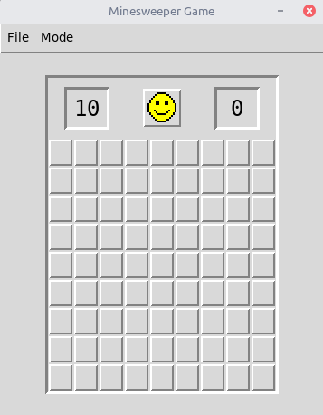
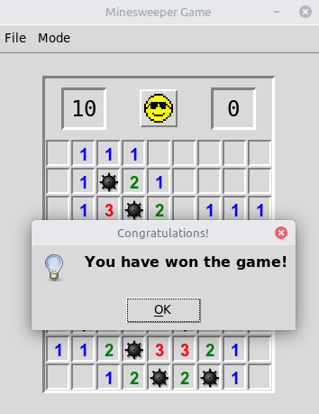

# Minesweeper the Game

This Python game has been my univesity project.
The GUI has been written on Tkinter.

**Feature list:**
- User authentication
    - Anonymous login
    - User data file
        1. Username
        2. Password
        3. Saved game in byte-code
        4. Rating score
        5. Game log
- Save and load the game
- User rating
- Three modes

---
